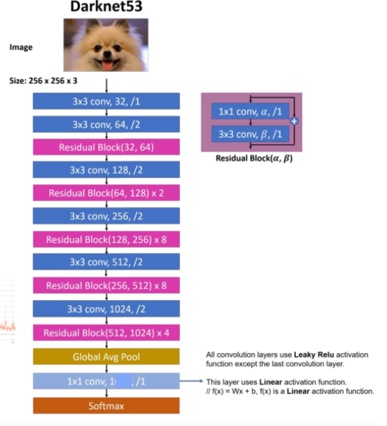

모델 정의를 main함수에 작성하면 너무 길어지므로 model 폴더를 생성해서 작성한다.

만든 모델을 models.py안에 get_model 함수를 통해 img_classify.py 파일에서 불러오기 쉽게 만든다.

# lenet5

모델 구조

| --- | --- | --- | --- | --- | --- |
| Layer | Feature map | size | kernel size | stride | activation | 
| input | 1 | 32 x 32 | - | - | - |
| 1 | convolution | 6 | 28 x 28 | 5 x 5 | 1 | tanh |
| 2 | average pooling | 6 | 14 x 14 | 2 x 2 | 2 | tanh | 
| 3 | convolution | 16 | 10 x 10 | 5 x 5 | 1 | tanh |
| 4 | average pooling | 16 | 5 x 5 | 2 x 2 | 1 | tanh |
| 5 | convolution | 120 | 1 x 1 | 5 x 5 | 1 | tanh |
| 6 | FC | - | 84 | - | - | tanh |
| output | FC | - | 10 | - | - | softmax | 

 

# darknet53

모델 구조

